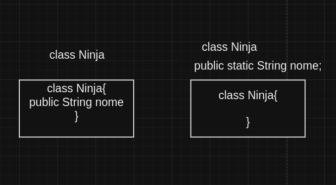

**paradgma**

É um padrão,

**classes**

Classes é um molde, voce define os metodos e os atributos.

**Objetos**

Espaço na memoria, instacias é objeto em especifico do que estamos fazendo

**metodo static**

eles são metodos da Class, metodos auxiliar ent tipo Ninja.metodo();

java.util.Date

epoch parar manipular datas

36m de segundos é uma hora 86400000 milissegundos é o vlaor de um dia